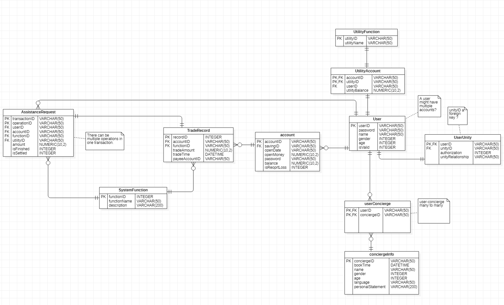

# Bank
JavaEE项目选题

 **3. 科技飞速发展，当我们享受着它为生活带来极大便利的同时，也请关注老年人群体，他们很难跟上并接受由技术推动的时代变革，进而无法从中受益。您有什么方式帮助年长的一代人拥抱数字转型并因此享受到相关的金融服务？ 举例说明：您可以从多个方面切入，让科技更加方便易用（例如更大的按钮，语音控制，更大的书写字体等）；或者提供“自助服务”和”礼宾服务”选项，以协助在使用过程中遇到困难的老年人快速寻求人工服务；还有，要考虑到老年人在需要帮助的同时并不想丧失独立性，如何能帮助他们在做子女账户关联的时候，子女的角色是“协助人“而非”控制人“？ 4. 其它任何“普惠金融”相关挑战。**

1. 正常银行服务
   1. 存款 孟繁霖
   2. 取款 孟繁霖
   3. 转账 孟繁霖
   4. 记录查询 孙昱卿
   5. 查看个人信息 孙昱卿
   6. 修改个人信息 孙昱卿
   7. 生活缴费 娄天宇
2. 老人自助服务（大号字体的一般银行服务）
   1. 【前端问题】
3. 子女账户协助（子女可以利用老人的账户协助操作）
   1. 权限控制||+子女老人表 王凌
   2. 权限授权
   3. 将子女帮助操作的结果存到数据库，老人按键调出，然后在老人端commit到数据库 娄天宇
4. 礼宾服务（可以分配一位现场工作人员）
   1. 从志愿者表中指定一个志愿者 王凌

